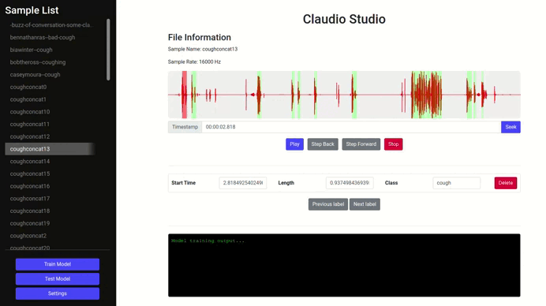

# Claudio Studio

In the world of sound engineering, music production, and language learning, the need to segment and label audio files is becoming increasingly important. Claudio Studio is an interactive application that allows users to visualize, annotate, and model their sound files, making the task of working with audio easy and intuitive.

**Project Purpose**

Claudio Studio was designed with the aim of simplifying the process of working with audio files by providing a user-friendly interface where waveforms can be visualized, annotated, and segmented. The application also provides functionality for training a simple machine learning model using the annotated data which can, for example, be used for tasks such as instrument recognition, music genre classification, or speech recognition.

<br />

**Table of Contents**
- [Project Overview](#project-overview)
- [Setup and Installation](#setup-and-installation)
- [Features](#features)
- [Usage](#usage)
- [Future Enhancements](#future-enhancements)
- [License](#license)

## Project Overview 

<p align="center">
  
</p>

## Setup and Installation

1. Clone the project repository.

   ```
   git clone https://github.com/mrconter1/ClaudioStudio.git
   ```

2. Navigate to the project directory
   ```
   cd ClaudioStudio
   ```

3. Install dependencies

   ```
   npm install
   ```

4. Run the server side application

   ```
   npm start
   ```

5. You can now access Claudio Studio at `localhost:3000`.

6. Data is to be placed in a `public/data` folder. One _.wav_ file with corresponding _.label_ file.

*Note: Make sure you have Node.js and Python installed in your system before running the above commands. If not installed, you can download them [here](https://nodejs.org/en/download/) and [here](https://www.python.org/downloads/) respectively.*

## Features

- **Audio Visualization:** Visualize your sound file in a waveform.
- **Audio Annotation:** Annotate your sound files with labels
- **Audio Segmentation:** Divide your sound files into several segments.
- **Train Model:** Train a simple machine learning model on your annotated sound files.
- **Model Evaluation:** Evaluate your model's performance.

## Usage

1. Upload a `.wav` audio file and its corresponding `.label` file. Make sure both files have the same name except the extension.
2. Select a file from the side navigation list.
3. Use the controls to play, pause, step back, step forward, and stop.
4. Annotate and label your sound files by clicking on the waveform. Labels can be adjusted or deleted. 
5. Once you're satisfied with your labels, click on "Train Model" to train a simple machine learning model.

## Future Enhancements

1. **Ability to support multiple categories:** Plan to extend the application to support multiple categories for a more diverse audio classification.
2. **Implement automated data augmentation:** Feature to enhance model performance by automatically generating new training data.
3. **Add Model Selection Control:** Provide users the ability to choose model characteristics like choosing different architecture and its variants.
4. **Add Audio Recording Feature in Web GUI:** Implement functionality that allows users to record audio directly in the web user interface and instantly test it against the model.
5. **Introduce an Evaluation Framework:** Plan to introduce a robust evaluation framework to gauge the model performance effectively.
6. **Make it easier to add new data:** Allow easier adding of new data.
7. **Encapsulation in a docker container:** Plan to encapsulate the entire application in a docker container for easy installation and deployment.

## License

This project is licensed under the [MIT License](LICENSE).

Note: This application is intended for educational purposes and is not suitable for commercial use in its current form. However, suggestions for improvements and contributions are welcome.
